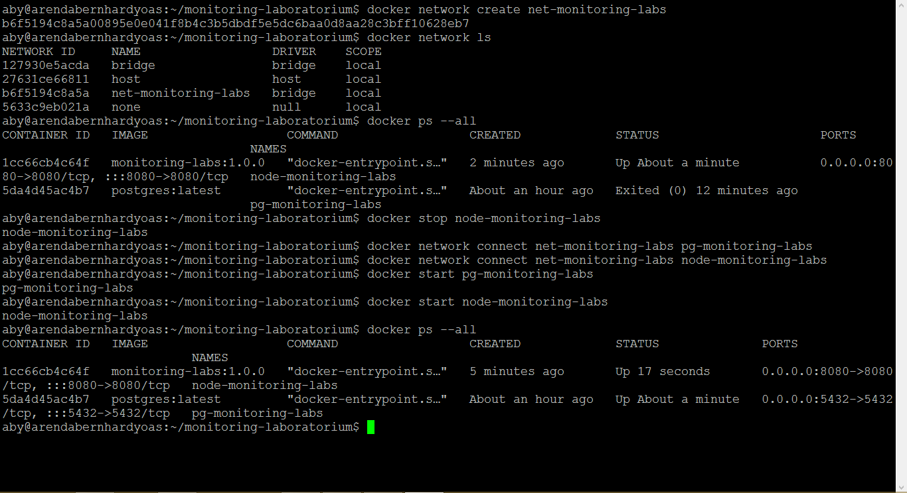

# Docker Container

## Pull image
`docker pull <image>:<tag>`.<br>
`docker pull docker.io/node:latest` or `docker pull node:latest` or `docker pull node`.<br>
`docker pull <image>:alpine` recommended for smaller image size.<br>
`docker images` see list images.<br>


## Build single container web server
`nano Dockerfile`<br>
```
FROM node

MAINTAINER Arenda Bernhard Yoas <aby@arendabernhardyoas.com>

RUN git clone --single-branch --branch nodejs https://github.com/arendabernhardyoas/monitoring-laboratorium.git

WORKDIR /monitoring-laboratorium

CMD node app
```

`docker build --tag monitoring-labs:1.0.0 ./`<br>
Reference build container from dockerfile [here](https://docs.docker.com/engine/reference/builder/).<br>
`docker run --detach --name monitoring-labs --publish 8080:8080 monitoring-labs:1.0.0`<br>


## Build multi container web server and database
`docker volume create pgdata-monitoring-labs`<br>
`docker run --detach --name pg-monitoring-labs --publish 5432:5432 --volume pgdata-monitoring-labs:/var/lib/postgresql/data --env POSTGRES_PASSWORD='' postgres:latest`<br>

`docker exec --interactive --tty pg-monitoring-labs bash -c "psql -U postgres"`<br>
`docker exec --interactive --tty pg-monitoring-labs bash -c "psql -U aby monitoring-laboratorium"`<br>


`nano Dockerfile`<br>
```
FROM node

MAINTAINER Arenda Bernhard Yoas <aby@arendabernhardyoas.com>

WORKDIR /monitoring-laboratorium

COPY . .

CMD node app
```

Define environment variable for database host NodeJS.<br>
`process.env.DB_HOST`<br>

`docker build --tag monitoring-labs:1.0.0 ./`<br>
`docker run --detach --name node-monitoring-labs --publish 8080:8080 --env DB_HOST=pg-monitoring-labs monitoring-labs:1.0.0`<br>

`docker network create net-monitoring-labs`<br>
`docker stop <container> <container...>` stop all running containers.<br>
`docker network connect net-monitoring-labs pg-monitoring-labs`<br>
`docker network connect net-monitoring-labs node-monitoring-labs`<br>
`docker start pg-monitoring-labs node-monitoring-labs`<br>



## Remove containers and images
`docker stop <container> <container...>` stop one or more running containers. Recommended to do first time if the containers are running.<br>
`docker rm <container> <container...>` remove one or more containers.<br>
`docker rmi <image> <image...>` remove one or more images.<br>


** **

**NOTE:**<br>
Host<br>
Ubuntu Server 20.04.X AMD64<br>
VirtualBox 6.1.2X on Desktop Windows 8.1 Pro
